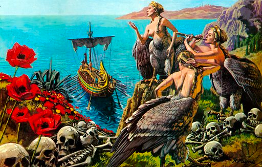

# the-mle-odyssey



```poem
In the realm where knowledge intertwines,
A Machine Learning Engineer shines,
Guiding data through uncharted seas,
With algorithms as their Odyssey.

Like Odysseus, they brave the storm,
To harness insights, they transform,
Through data's depths, they boldly dive,
In search of patterns to revive.

Just as Odysseus faced the Cyclops' wrath,
Engineers tackle models' aftermath,
Optimizing algorithms with might,
To conquer challenges in their sight.

Like Athena, the goddess wise,
They strategize and analyze,
Guiding machines with skillful hand,
To unravel mysteries, understand.

From Python's shores to R's domain,
They navigate the realms of code and train,
Their expertise, a beacon light,
Amidst the data's darkest night.

Like Circe, they enchant the data's tale,
Unveiling secrets, they never fail,
Unraveling patterns in a web so vast,
Creating insights that forever last.

But just as Odysseus yearned for home,
Engineers dream, no longer to roam,
They seek the truth, the Holy Grail,
To build a future where AI prevails.

With TensorFlow as their trusted guide,
They traverse the landscapes far and wide,
Merging art and science, they unite,
To forge a future of wondrous might.

So, raise your glasses to the ML Engineer,
Whose journey's akin to Odyssey's seafarer,
With passion, knowledge, and courage grand,
They shape the world with a visionary hand.

By ChatGPT
```
