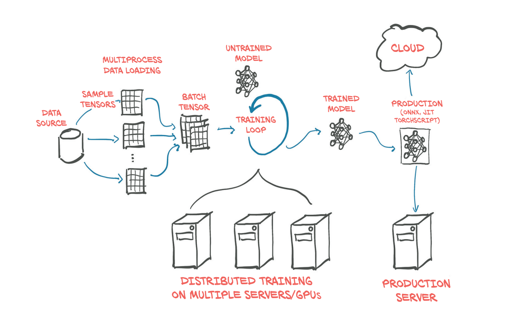
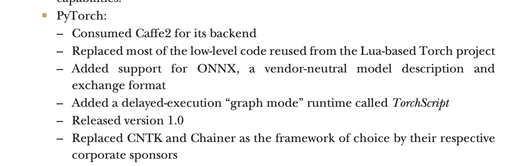

Source: https://www.manning.com/books/deep-learning-with-pytorch

Let's show some insightful definitions from the source book.

>PyTorch is a library for Python programs that facilitates building deep learning projects. It emphasizes flexibility and allows deep learning models to be expressed in idiomatic Python. This approachability and ease of use found early adopters in the
research community, and in the years since its first release, it has grown into one of
the most prominent deep learning tools across a broad range of applications.

>PyTorch gives us a data type, the Tensor, to hold numbers, vectors, matrices,
or arrays in general. In addition, it provides functions for operating on them. We can
program with them incrementally and, if we want, interactively, just like we are used to
from Python. If you know NumPy, this will be very familiar.

>In fact, we can safely characterize PyTorch as a high-performance library
with optimization support for scientific computing in Python.

Pytorch is not just a programming language, but a whole ecosystem. I like the following image, which shows
how a complete ML project can be orchestrated using PyTorch as its primary framework.

We'll talk later about ONNX. But for now, just look at PyTorch evolution.

